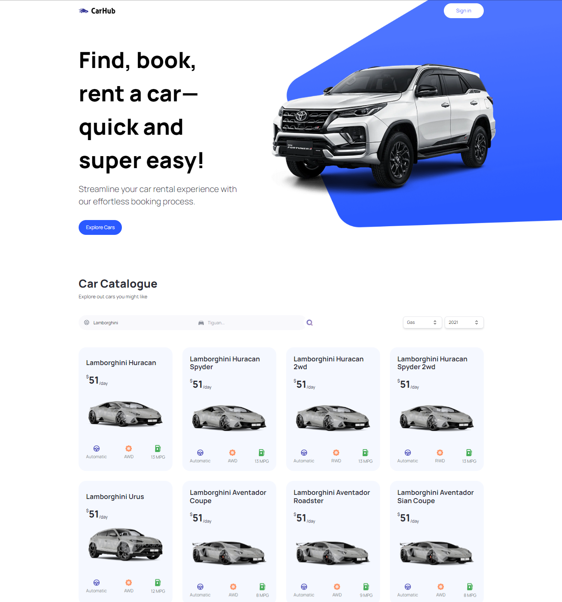

# Modern Next.js 13 Car Showcase with search Application

<a href='https://car-showcase-next13-drab.vercel.app/' target='_blank'>

</a>

[Live link](https://car-showcase-next13-drab.vercel.app/)

Welcome to the Modern Next.js 13 Car Showcase & Search Application! This project is built using React, Next.js 13, TypeScript, and Tailwind CSS. It incorporates SEO optimization and server rendering to enhance user experience and performance. With this application, users can easily search for cars.

## Table of Contents

- [Getting Started](#getting-started)
  - [Prerequisites](#prerequisites)
  - [Installation](#installation)
  - [Running the Application](#running-the-application)
- [Features](#features)
- [SEO and Server Rendering](#seo-and-server-rendering)
- [Technologies Used](#technologies-used)
- [Contributing](#contributing)
- [License](#license)

## Getting Started

Follow these instructions to get the project up and running on your local machine.

### Prerequisites

- Node.js
- npm
- Git

### Installation

1. Clone the repository:

```bash
git clone https://github.com/developer-shajib/Car-Showcase-with-Next-13
```

2. Navigate to the project directory:

```bash
cd Car-Showcase-with-Next-13
```

3. Install dependencies:

```bash
npm install
```

### Running the Application

1. Start the development server:

```bash
npm run dev
```

2. Open your browser and navigate to `http://localhost:3000` to access the application.

## Features

- Car Search: Users can easily search for cars using the search feature.
- Responsive Design: The application is responsive and works seamlessly on different devices.
- Modern UI: The user interface is designed using Tailwind CSS for a sleek and modern look.

## SEO and Server Rendering

The application is optimized for SEO (Search Engine Optimization) to improve its visibility on search engines. Server rendering is implemented using Next.js, ensuring faster initial page loads and improved performance.

## Technologies Used

- React
- Next.js 13
- TypeScript
- Tailwind CSS
- SEO Optimization
- Server Rendering

Thank you for using the Modern Next.js 13 Car Search Application! If you have any questions or need assistance, please don't hesitate to open an issue or contact us.

_This README template is provided for your convenience. Make sure to replace placeholders with actual project details._
